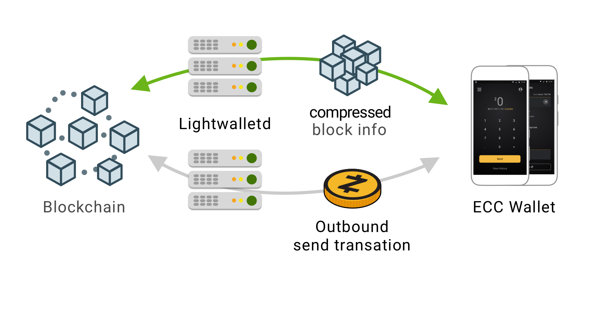

# Zcash Lightwallet Nodes

## Introduction

Zcash, a privacy-focused cryptocurrency, supports a feature called "lightwallet nodes" that enables users to interact with the Zcash blockchain without downloading the entire blockchain history. This wiki page provides an overview of lightwallet nodes, the role of the "lightwalletd" service in the Zcash ecosystem, a current list of lightwallet node servers, and instructions on how to change servers in popular wallets like Ywallet and Zingo.

## Lightwalletd Service

The "lightwalletd" service, short for "lightwallet daemon," plays a critical role in Zcash's lightwallet node ecosystem. It acts as an intermediary that provides lightweight clients (lightwallets) with the information they need to function effectively. Here's a brief explainer of the lightwalletd service:

__Data Aggregator__: Lightwalletd aggregates data from the Zcash blockchain, such as transaction information, block data, and shielded pool information.

__Simplified Verification__: Lightwalletd performs simplified verification of this data, allowing lightwallets to access necessary information without having to validate the entire blockchain.

__Privacy Preservation__: The service maintains the privacy of Zcash users by not requiring them to expose their viewing keys or personal transaction information.

__Efficient Synchronization__: Lightwalletd enables efficient synchronization for lightwallets, significantly reducing the time and resources required to get up to date with the Zcash blockchain.

## Current List of Lightwalletd Servers

Here is a list of some current Zcash Lightwallet Nodes that users can connect to:

[North America](https://na.lightwalletd.com/)

[South America](https://sa.lightwalletd.com/)

[Europe & Africa](https://eu.lightwalletd.com/)

[Asia & Oceania](https://ai.lightwalletd.com/)

## Changing Servers in Ywallet/Zingo

Changing the lightwallet node server in Ywallet or Zingo is relatively straightforward:

__Open Ywallet/Zingo__: Launch the Ywallet or Zingo application on your device.

__Access Settings__: Find and access the settings or preferences menu within the application.

__Select Server__: Look for the option to change the lightwallet node server. This option is usually named "Change server" or "Node settings."

__Enter Server Information__: You will be prompted to enter the new server's address. Input the URL of the desired server from the current list or any other server you prefer.
__
__Save or Confirm__: Save the changes, and the application should now connect to the new server.

Remember to ensure that the new server is active and reliable to maintain seamless communication with the Zcash network.

## Conclusion

Zcash's lightwallet nodes and the lightwalletd service provide a convenient and privacy-preserving way for users to interact with the blockchain. The ability to change servers offers flexibility in selecting a node that best suits your needs. Stay updated with the latest server information for optimal functionality and privacy when using Zcash lightwallets.
